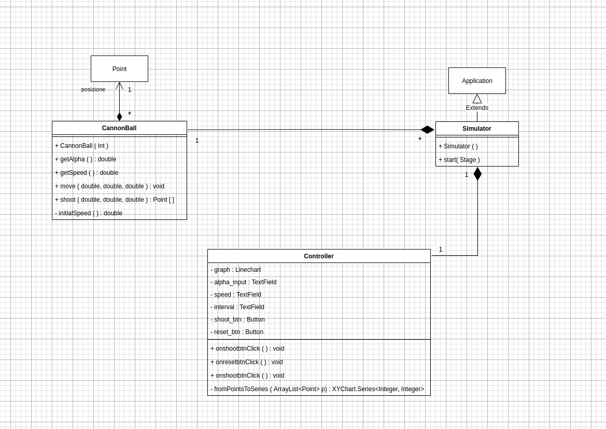
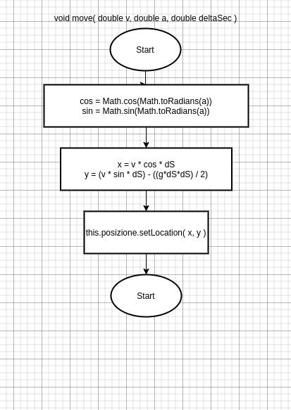
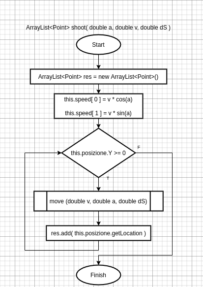

# CannonBall simulator

This program simulates the bullet motion. For the UI I used JavaFX, the only thing I implemented
myself is the bullet and the methods to shoot it.

## <u>UML Schema</u>

## <u>Methods</u>

